# 🏫 Enhanced School Role System - User Manual

> **Version**: 1.0  
> **Last Updated**: January 2025  
> **Status**: Active Implementation

---

## 📋 Table of Contents

1. [Overview](#overview)
2. [Role Structure](#role-structure)
3. [Role Capabilities Matrix](#role-capabilities-matrix)
4. [Implementation Guide](#implementation-guide)
5. [Migration Instructions](#migration-instructions)
6. [Security & Compliance](#security--compliance)
7. [Troubleshooting](#troubleshooting)
8. [Change Log](#change-log)

---

## 🎯 Overview

The Enhanced School Role System provides a streamlined, secure approach to managing user permissions across all school levels, with particular focus on **primary and larger schools** where role complexity and staff differentiation is most critical.

### **Key Benefits**
- ✅ **Granular Permission Control** - Precise access management for each role
- ✅ **FERPA Compliant** - Maintains strict educational privacy standards
- ✅ **Scalable Design** - Works for small schools to large districts
- ✅ **Backward Compatible** - Existing users continue working seamlessly
- ✅ **Zero Downtime Migration** - Transition without service interruption

### **Target Environments**
- **Primary Focus**: Elementary schools, large middle schools, high schools
- **Secondary Benefit**: Smaller schools with simplified role needs
- **Scalability**: Handles complex staff hierarchies and specialized roles

---

## 🎭 Role Structure

### **Administrative Roles**

#### 👑 **System Administrator** (`admin`)
- **Purpose**: Full system control and configuration
- **Typical Users**: IT administrators, district-level tech staff
- **Access Level**: Unrestricted

#### 🏫 **School Administrator** (`school_admin`)
- **Purpose**: Day-to-day school operations management
- **Typical Users**: Principals, assistant principals, office managers
- **Access Level**: Full school operations, limited system settings

#### 📋 **504 Plan Coordinator** (`admin_504`)
- **Purpose**: 504 plan and IEP coordination with aide management
- **Typical Users**: 504 coordinators, compliance officers
- **Access Level**: All students, admin panel, aide management

#### 🎓 **Special Education Chair** (`sped_chair`)
- **Purpose**: Special education program leadership
- **Typical Users**: Special education directors, department heads
- **Access Level**: Full special education oversight

### **Staff Roles**

#### 👀 **Staff Viewer** (`staff_view`)
- **Purpose**: IEP access for support staff
- **Typical Users**: Counselors, nurses, intervention specialists
- **Access Level**: View-only access to all student information
- **⚠️ Note**: NOT for substitutes or observers - they get NO ACCESS

#### ✏️ **Staff Editor** (`staff_edit`)
- **Purpose**: Edit student records without admin access
- **Typical Users**: Registrars, data clerks, student services staff
- **Access Level**: Edit all students, no admin panel access

### **Operational Roles**

#### 👨‍🏫 **Case Manager** (`case_manager`)
- **Purpose**: Manage assigned student caseload
- **Typical Users**: Special education case managers
- **Access Level**: Assigned students only

#### 📚 **Teacher** (`teacher`)
- **Purpose**: Classroom instruction and student management
- **Typical Users**: General education and special education teachers
- **Access Level**: Students in assigned classes

#### 🔧 **Service Provider** (`service_provider`)
- **Purpose**: Specialized student services
- **Typical Users**: Speech therapists, occupational therapists, counselors
- **Access Level**: Students receiving their services

#### 👥 **Paraeducator** (`paraeducator`)
- **Purpose**: Instructional support and aide services
- **Typical Users**: Teaching assistants, one-on-one aides
- **Access Level**: Assigned students only

---

## 🎨 Visual Role Structure

### **Role Hierarchy Overview**

```mermaid
graph TB
    subgraph "Administrative Hierarchy"
        A["👑 admin<br/>System Administrator<br/><i>Full System Control</i>"]
        B["🏫 school_admin<br/>School Administrator<br/><i>School Operations</i>"]
        C["📋 admin_504<br/>504 Plan Coordinator<br/><i>504 & IEP + Aides</i>"]
        D["🎓 sped_chair<br/>Special Ed Chair<br/><i>Special Ed Leadership</i>"]
    end
    
    subgraph "Staff Roles"
        E["👀 staff_view<br/>Staff Viewer<br/><i>IEP Access Only</i>"]
        F["✏️ staff_edit<br/>Staff Editor<br/><i>Edit Students Only</i>"]
    end
    
    subgraph "Operational Roles"
        G["👨‍🏫 case_manager<br/>Case Manager<br/><i>Assigned Caseload</i>"]
        H["📚 teacher<br/>Teacher<br/><i>Class Students</i>"]
        I["🔧 service_provider<br/>Service Provider<br/><i>Served Students</i>"]
        J["👥 paraeducator<br/>Paraeducator<br/><i>Assigned Students</i>"]
    end
    
    subgraph "Access Levels"
        K["🔴 Full System Access"]
        L["🟡 Admin Panel Access"]
        M["🟢 Student Data Only"]
        N["🔵 Limited Student Access"]
    end
    
    A --> K
    B --> L
    C --> L
    D --> L
    E --> M
    F --> M
    G --> N
    H --> N
    I --> N
    J --> N
```



### **Permission Flow Diagram**

```mermaid
graph TD
    A["👑 admin<br/>System Administrator"] --> B["Full System Access"]
    B --> B1["All Students"]
    B --> B2["Full Admin Panel"]
    B --> B3["Manage Aides"]
    B --> B4["System Settings"]
    
    C["🏫 school_admin<br/>School Administrator"] --> D["School Management"]
    D --> D1["All Students"]
    D --> D2["Admin Panel*"]
    D --> D3["Manage Aides"]
    D --> D4["Manage Users"]
    
    E["📋 admin_504<br/>504 Plan Coordinator"] --> F["504 & IEP Management"]
    F --> F1["All Students"]
    F --> F2["Admin Panel*"]
    F --> F3["Manage Aides"]
    F --> F4["Manage Users"]
    
    G["🎓 sped_chair<br/>Special Ed Chair"] --> H["Special Ed Leadership"]
    H --> H1["All Students"]
    H --> H2["Admin Panel*"]
    H --> H3["Manage Aides"]
    H --> H4["Full Testing"]
    
    I["👀 staff_view<br/>Staff Viewer"] --> J["IEP Access Only"]
    J --> J1["View All Students"]
    J --> J2["No Admin Panel"]
    
    K["✏️ staff_edit<br/>Staff Editor"] --> L["Student Editing"]
    L --> L1["Edit All Students"]
    L --> L2["No Admin Panel"]
```



*\* Admin Panel access can be customized by system administrator*

---

## 📊 Role Capabilities Matrix

| Role | Students | Admin Panel | Aide Management | User Management | System Settings | Testing Access |
|------|----------|-------------|-----------------|-----------------|-----------------|----------------|
| `admin` | All (Edit) | ✅ Full | ✅ Full | ✅ Full | ✅ Full | ✅ All |
| `school_admin` | All (Edit) | ✅ Limited* | ✅ Full | ✅ Limited | ❌ None | ✅ Partial |
| `admin_504` | All (Edit) | ✅ Limited* | ✅ Full | ✅ Limited | ❌ None | ✅ Partial |
| `sped_chair` | All (Edit) | ✅ Limited* | ✅ Full | ❌ None | ❌ None | ✅ All |
| `staff_view` | All (View) | ❌ None | ❌ None | ❌ None | ❌ None | ✅ Partial |
| `staff_edit` | All (Edit) | ❌ None | ❌ None | ❌ None | ❌ None | ✅ Partial |
| `case_manager` | Assigned (Edit) | ❌ None | ❌ None | ❌ None | ❌ None | ❌ None |
| `teacher` | Classes (View) | ❌ None | ❌ None | ❌ None | ❌ None | ❌ None |
| `service_provider` | Served (Edit) | ❌ None | ❌ None | ❌ None | ❌ None | ❌ None |
| `paraeducator` | Assigned (View) | ❌ None | ❌ None | ❌ None | ❌ None | ❌ None |

**\* Limited Admin Panel**: Access to admin functions but system admin can hide specific panels per role

---

## 🔧 Implementation Guide

### **For New Users**

1. **Create User Account**
   ```javascript
   // Use the new role names when creating users
   const newUser = {
     name: "Jane Smith",
     email: "jane.smith@school.edu",
     role: "school_admin", // Use new role names
     aeriesId: "T123456789"
   }
   ```

2. **Assign Appropriate Role**
   - Choose from the new role structure
   - Consider the user's actual responsibilities
   - Use the most restrictive role that still allows necessary functions

### **For Existing Users**

Existing users continue working with their current roles. The system maintains full backward compatibility:

- `administrator` → Functions as `staff_view`
- `administrator_504_CM` → Functions as `admin_504`
- All other roles remain unchanged

### **Role Migration Process**

#### **Option 1: Automatic Migration (Recommended)**

```javascript
// Preview what would be migrated (dry run)
migrateUserRoles({ dryRun: true })

// Execute the migration
migrateUserRoles({ dryRun: false })
```

#### **Option 2: Manual Migration**

1. **Identify Users**: Review current role assignments
2. **Plan Migration**: Map old roles to new roles
3. **Update Gradually**: Migrate users in small batches
4. **Verify Access**: Test each migrated user's access

---

## 🔄 Migration Instructions

### **Pre-Migration Checklist**

- [ ] **Backup Database**: Create full system backup
- [ ] **Test Environment**: Verify changes in staging
- [ ] **User Communication**: Notify staff of upcoming changes
- [ ] **Access Verification**: Document current user access levels

### **Migration Steps**

#### **Step 1: Preview Migration**
```bash
# Call the migration function with dry run
firebase functions:shell
> migrateUserRoles({ dryRun: true })
```

#### **Step 2: Review Migration Plan**
- Check the list of users to be migrated
- Verify role mappings are correct
- Identify any users needing special handling

#### **Step 3: Execute Migration**
```bash
# Execute the actual migration
> migrateUserRoles({ dryRun: false })
```

#### **Step 4: Verify Results**
- Test login for migrated users
- Verify access levels are correct
- Address any issues immediately

### **Migration Mapping**

| Old Role | New Role | Notes |
|----------|----------|-------|
| `administrator` | `staff_view` | IEP access for support staff |
| `administrator_504_CM` | `admin_504` | 504 coordination with aide management |
| All others | Unchanged | No migration needed |

---

## 🔒 Security & Compliance

### **FERPA Compliance**

The role system maintains strict FERPA compliance through:

- **Database-Level Security**: Firestore rules enforce permissions
- **Role-Based Access**: Users only see data they're authorized for
- **Audit Logging**: All access attempts are logged
- **Minimal Access Principle**: Users get only necessary permissions

### **Security Features**

#### **Multi-Layer Protection**
1. **Authentication**: Firebase Auth with Google SSO
2. **Authorization**: Custom claims and Firestore rules
3. **Data Filtering**: Database-level student access control
4. **Audit Trail**: Comprehensive access logging

#### **Access Control**
- **Student Access**: Based on staffIds, caseload, or class assignments
- **File Access**: Secure PDF handling with role verification
- **Admin Functions**: Restricted to appropriate administrative roles

### **Privacy Safeguards**

- **Staff Viewer Role**: Designed for legitimate educational interest only
- **No Observer Access**: Substitutes and observers get NO system access
- **Granular Permissions**: Each role has precisely defined access levels
- **Regular Audits**: Access patterns monitored and logged

---

## 🛠️ Troubleshooting

### **Common Issues**

#### **User Cannot Access Admin Panel**
**Symptoms**: User sees "Access Denied" when trying to access admin functions
**Solutions**:
1. Verify user has admin role: `admin`, `school_admin`, `admin_504`, or `sped_chair`
2. Check custom claims are synced: Use `syncCustomClaims` function
3. Verify Firestore rules are deployed correctly

#### **Student Data Not Visible**
**Symptoms**: User cannot see expected students
**Solutions**:
1. Check user's `staffIds` assignments on student records
2. Verify case manager assignments for case managers
3. Confirm class assignments for teachers
4. Check aide assignments for paraeducators

#### **Migration Issues**
**Symptoms**: Users cannot login after migration
**Solutions**:
1. Verify custom claims were updated correctly
2. Check Firestore user document has new role
3. Clear browser cache and cookies
4. Re-sync custom claims if needed

### **Support Contacts**

- **Technical Issues**: IT Administrator
- **Role Questions**: School Administrator
- **Access Problems**: System Administrator

---

## 📈 Change Log

### **Version 1.0** - January 2025
- **Initial Release**: Enhanced role system implementation
- **New Roles**: Added `school_admin`, `staff_view`, `staff_edit`, `admin_504`
- **Migration Function**: Automated role migration capability
- **Backward Compatibility**: Full support for existing role names
- **Security Enhancements**: Improved FERPA compliance and access control

---

## 🔮 Future Enhancements

### **Planned Features**
- **Role Templates**: Pre-configured role sets for different school types
- **Dynamic Permissions**: Admin-configurable role permissions
- **Bulk User Management**: Enhanced tools for managing multiple users
- **Advanced Reporting**: Detailed access and usage analytics

### **Under Consideration**
- **Department-Level Roles**: Roles scoped to specific departments
- **Time-Based Access**: Temporary role assignments
- **External Integration**: SSO with other educational systems

---

## 📞 Support & Documentation

### **Resources**
- **Technical Documentation**: `/Documentation/` folder
- **Security Guidelines**: `FERPA_COMPLIANCE_CHECKLIST.md`
- **Migration Plan**: `MIDDLE_SCHOOL_ROLE_MIGRATION_PLAN.md`

### **Getting Help**
1. **Check Documentation**: Review relevant guides first
2. **Test in Staging**: Verify issues in test environment
3. **Contact Support**: Reach out to system administrator
4. **Log Issues**: Document problems for faster resolution

---

*This manual is a living document and will be updated as the system evolves. Last updated: January 2025*