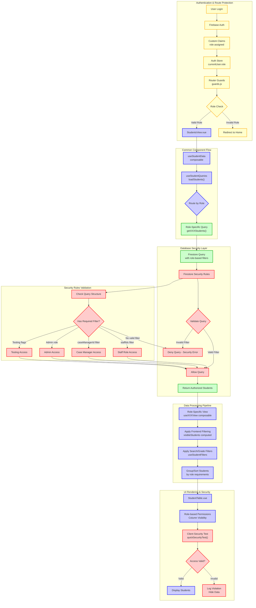

# Generic Flow - Common Authentication & Security (Before Role Check)

This diagram shows the common flow that all user roles go through before reaching their specific view logic.

## Key Security Layers:

1. **Authentication**: Firebase Auth with custom role claims
2. **Route Protection**: Router guards validate roles before component access
3. **Database Security**: Firestore rules enforce query-level filtering
4. **Application Logic**: Frontend role-based filtering and processing
5. **UI Security**: Component-level permissions and client-side validation
6. **Audit**: Security violation logging and monitoring

This common flow ensures that all roles go through the same security validation before reaching their specific view logic. 