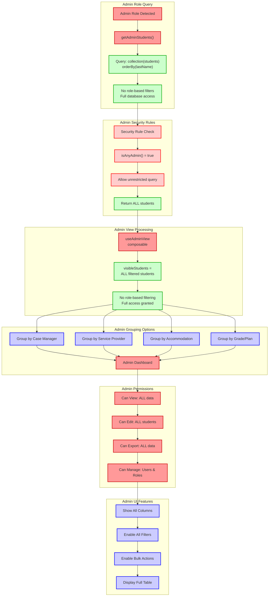

# Admin View - Full Administrative Access

This diagram shows how the admin role works after the common authentication flow, with unrestricted database access and full administrative capabilities.

## Admin Role Characteristics:

### **Database Access**
- **Query Type**: Unrestricted collection query
- **Filters**: None required (orderBy only)
- **Security**: Admin role bypass in Firestore rules
- **Data Scope**: All students in database

### **View Processing**
- **Composable**: `useAdminView`
- **Filtering**: Frontend search/grade filters only
- **Restrictions**: None - full access granted

### **Permissions**
- ✅ **View**: All student data including sensitive information
- ✅ **Edit**: All students, all fields
- ✅ **Export**: Complete data export capabilities
- ✅ **Manage**: User accounts, roles, system settings

### **UI Features**
- **Columns**: All available columns visible
- **Filters**: All filter options enabled
- **Actions**: Bulk operations, advanced management tools
- **Grouping**: Multiple grouping options available

### **Security Notes**
- Admins bypass most security restrictions
- Full audit logging for admin actions
- Highest level of system access
- Responsible for user management and system configuration 