# Teacher View - Database-Filtered Student Access

This diagram shows how the teacher role works after authentication, with database-level security filtering and read-only access to assigned students.

```mermaid
graph TB
    subgraph "Teacher Role Query"
        A[Teacher Role Detected] --> B["getTeacherStudents(userId)"]
        B --> C["Query: where(app.staffIds,<br/>array-contains, userId)"]
        C --> D["Database-level filtering<br/>by staffIds array"]
    end
    
    subgraph "Teacher Security Rules"
        D --> E["Security Rule Check"]
        E --> F["hasStaffIdsFilter() = true"]
        F --> G["Verify userId in query<br/>matches auth.uid"]
        G --> H["Allow filtered query"]
        H --> I["Return ONLY assigned students"]
    end
    
    subgraph "Teacher View Processing"
        I --> J["useTeacherView<br/>composable"]
        J --> K["Additional frontend filtering<br/>by schedule periods"]
        K --> L["visibleStudents =<br/>students in teacher classes"]
    end
    
    subgraph "Teacher Grouping"
        L --> M["Group by Period<br/>studentsByPeriod"]
        M --> N["Group by Accommodation<br/>instruction/assessment"]
        N --> O["Group by Service Provider"]
        O --> P[Teacher Class View]
    end
    
    subgraph "Teacher Permissions"
        P --> Q["Can View: Basic info,<br/>accommodations, services"]
        Q --> R["Cannot View: Dates,<br/>sensitive IEP data"]
        R --> S["Cannot Edit: Any student data"]
        S --> T["Cannot Export: Student data"]
    end
    
    subgraph "Teacher UI Features"
        T --> U["Show Limited Columns"]
        U --> V["Enable Class View"]
        V --> W["Enable Period Filtering"]
        W --> X["Read-Only Table"]
    end
    
    classDef teacher fill:#99ccff,stroke:#0066cc,stroke-width:2px
    classDef security fill:#ffcccc,stroke:#ff0000,stroke-width:2px
    classDef data fill:#ccffcc,stroke:#00aa00,stroke-width:2px
    classDef ui fill:#ccccff,stroke:#0000ff,stroke-width:2px
    
    class A,B,J,P,Q,R,S,T teacher
    class E,F,G,H security
    class C,D,I,K,L data
    class M,N,O,U,V,W,X ui
```

## Teacher Role Characteristics:

### **Database Access**
- **Query Type**: `where('app.staffIds', 'array-contains', userId)`
- **Security**: Required staffIds filter enforced by Firestore rules
- **Data Scope**: Only students where teacher is in staffIds array
- **Validation**: User ID in query must match authenticated user

### **View Processing**
- **Composable**: `useTeacherView`
- **Additional Filtering**: Frontend filtering by schedule periods
- **Access Logic**: Students where teacher is assigned to teach

### **Permissions**
- ✅ **View**: Basic student information, accommodations, service providers
- ❌ **Cannot View**: Sensitive dates (review, reevaluation, meeting dates)
- ❌ **Cannot Edit**: Any student data (read-only access)
- ❌ **Cannot Export**: Student data export restricted

### **UI Features**
- **Columns**: Limited column set (basic info, accommodations)
- **Class View**: Enabled - group students by period
- **Filters**: Period filtering, basic search
- **Actions**: Read-only - no edit or delete actions

### **Security Features**
- **Database-Level**: staffIds array ensures secure filtering at query level
- **Frontend Validation**: Additional schedule-based access verification
- **Audit Logging**: Access attempts logged for security monitoring
- **Role Verification**: Continuous validation of teacher assignment to students

### **Grouping Options**
- **By Period**: Students grouped by class periods taught
- **By Accommodation**: Instruction and assessment accommodation groups
- **By Service Provider**: Students grouped by their service providers

This ensures teachers can only access students they actively teach, with appropriate read-only permissions for classroom management. 