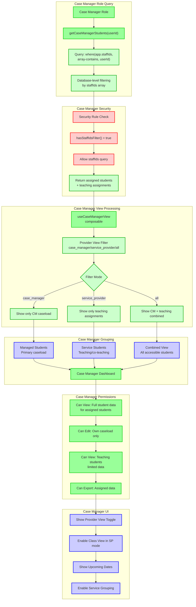

# Case Manager View - Dual Role Access with Provider Views

This diagram shows how case managers access students through both their caseload assignments and teaching responsibilities, with a provider view toggle system.

## Case Manager Role Characteristics:

### **Database Access**
- **Query Type**: `where('app.staffIds', 'array-contains', userId)`
- **Security**: Required staffIds filter enforced by Firestore rules
- **Data Scope**: Students on caseload + students in classes taught
- **Dual Access**: Both case management and teaching assignments

### **Provider View System**
The case manager has three distinct view modes:

#### **Case Manager Mode** (`case_manager`)
- **Shows**: Only students where user is the primary case manager
- **Access Level**: Full edit permissions for caseload students
- **Data**: Complete student records, IEP details, dates

#### **Service Provider Mode** (`service_provider`)
- **Shows**: Only students where user teaches or co-teaches
- **Access Level**: Read-only for teaching assignments
- **Data**: Limited to classroom-relevant information

#### **All Mode** (`all`)
- **Shows**: Combined view of both caseload and teaching students
- **Access Level**: Mixed permissions based on relationship type
- **Data**: Full data for caseload, limited data for teaching

### **Permissions by Mode**
- **Caseload Students**: ✅ View all, ✅ Edit all, ✅ Export all
- **Teaching Students**: ✅ View limited, ❌ Cannot edit, ✅ Export limited
- **Dates & IEP Data**: ✅ Full access for caseload, ❌ Restricted for teaching

### **UI Features**
- **Provider View Toggle**: Switch between CM/SP/All modes
- **Class View**: Available in SP mode for period-based grouping  
- **Upcoming Dates**: Shows review/reevaluation dates for caseload
- **Service Grouping**: Group students by accommodation and service types

### **Security Features**
- **Database-Level**: staffIds array includes both CM and teaching assignments
- **Role Validation**: Continuous verification of dual role access
- **Permission Enforcement**: Different permissions based on relationship type
- **Audit Logging**: Tracks access mode switches and data access patterns

### **Workflow Benefits**
- **Unified Access**: Single login for both case management and teaching duties
- **Context Switching**: Easy toggle between different professional responsibilities
- **Appropriate Permissions**: Full access for caseload, appropriate limits for teaching
- **Efficient Navigation**: Quick access to relevant student groups based on current task

This dual-role system allows case managers to efficiently manage both their assigned caseload and their teaching responsibilities within a single, secure interface. 