# Service Provider View - Service-Focused Student Access

This diagram shows how service providers access students they provide services to, including dual roles as both service providers and teachers.

```mermaid
graph TB
    subgraph "Service Provider Role Query"
        A[Service Provider Role] --> B["getServiceProviderStudents(userId)"]
        B --> C["Query: where(app.staffIds,<br/>array-contains, userId)"]
        C --> D["Database-level filtering<br/>by staffIds array"]
    end
    
    subgraph "Service Provider Security"
        D --> E["Security Rule Check"]
        E --> F["hasStaffIdsFilter() = true"]
        F --> G["Verify service provider<br/>in student staffIds"]
        G --> H["Return students where<br/>user provides services"]
    end
    
    subgraph "Service Provider Processing"
        H --> I["useServiceProviderView<br/>composable"]
        I --> J["Filter by service assignments<br/>providers object"]
        J --> K["Also check teaching schedule<br/>dual role support"]
    end
    
    subgraph "Service Provider Filtering"
        K --> L["Students receiving<br/>direct services"]
        L --> M["Students in classes<br/>where SP teaches"]
        M --> N["Combined service<br/>+ teaching students"]
        N --> O[Service Provider View]
    end
    
    subgraph "Service Provider Permissions"
        O --> P["Can View: Service-related data<br/>accommodations, goals"]
        P --> Q["Cannot Edit: Student records"]
        Q --> R["Can View: Schedule periods<br/>where assigned"]
        R --> S["Limited Export: Service data"]
    end
    
    subgraph "Service Provider UI"
        S --> T["Show Service Type Groups"]
        T --> U["Enable Period View<br/>for teaching assignments"]
        U --> V["Show Accommodation Focus"]
        V --> W["Read-Only Service Table"]
    end
    
    classDef sp fill:#ffcc99,stroke:#ff6600,stroke-width:2px
    classDef security fill:#ffcccc,stroke:#ff0000,stroke-width:2px
    classDef data fill:#ccffcc,stroke:#00aa00,stroke-width:2px
    classDef ui fill:#ccccff,stroke:#0000ff,stroke-width:2px
    
    class A,B,I,O,P,Q,R,S sp
    class E,F,G security
    class C,D,H,J,K,L,M,N data
    class T,U,V,W ui
```

## Service Provider Role Characteristics:

### **Database Access**
- **Query Type**: `where('app.staffIds', 'array-contains', userId)`
- **Security**: Required staffIds filter enforced by Firestore rules
- **Data Scope**: Students receiving services + students in classes taught
- **Dual Role**: Service provision and teaching assignments

### **Access Types**

#### **Direct Service Access**
- **Students**: Those receiving direct services (speech, OT, mental health, etc.)
- **Data**: Service-related accommodations, goals, progress
- **Permissions**: Read-only access to service-relevant information

#### **Teaching Access** 
- **Students**: Those in classes where service provider also teaches
- **Data**: Classroom accommodations, basic student information
- **Permissions**: Read-only classroom management data

### **View Processing**
- **Composable**: `useServiceProviderView`
- **Service Filtering**: Filter by providers object in student records
- **Schedule Filtering**: Also check teaching schedule for dual roles
- **Combined Access**: Merge service and teaching student lists

### **Permissions**
- ✅ **View**: Service-related data, accommodations, goals
- ✅ **View**: Schedule periods where assigned as teacher
- ❌ **Cannot Edit**: Student records (read-only access)
- ✅ **Limited Export**: Service-focused data only

### **UI Features**
- **Service Type Groups**: Students grouped by service type (speech, OT, MH)
- **Period View**: For teaching assignments, group by class periods
- **Accommodation Focus**: Highlight instruction/assessment accommodations
- **Read-Only Table**: No edit capabilities, service-focused display

### **Service Types Supported**
- **Speech Therapy**: Students with speechId assignments
- **Occupational Therapy**: Students with otId assignments  
- **Mental Health**: Students with mhId assignments
- **Other Services**: Additional service provider types

### **Security Features**
- **Database-Level**: staffIds array includes service provider assignments
- **Service Validation**: Verify provider assignment in student records
- **Dual Role Support**: Handle both service and teaching responsibilities
- **Audit Logging**: Track service provider access patterns

### **Workflow Benefits**
- **Service Focus**: Interface optimized for service delivery needs
- **Accommodation Emphasis**: Quick access to relevant accommodations
- **Teaching Integration**: Seamless access to students in taught classes
- **Read-Only Safety**: Prevents accidental modifications to student records

This system ensures service providers have appropriate access to students they serve, with a focus on service-related information while maintaining data security. 