# Paraeducator View - Aide Schedule-Based Access

This diagram shows how paraeducators (aides) access students through aide schedule assignments, with the most restrictive permissions in the system.

```mermaid
graph TB
    subgraph "Paraeducator Role Query"
        A[Paraeducator Role] --> B["getParaeducatorStudents(userId)"]
        B --> C["Check aideSchedules<br/>collection first"]
        C --> D["Get aide assignment data<br/>direct + class assignments"]
    end
    
    subgraph "Paraeducator Security"
        D --> E["Query ALL students<br/>with server-side sorting"]
        E --> F["Client-side filtering<br/>by aide assignments"]
        F --> G["Validate direct assignments<br/>+ class assignments"]
        G --> H["Return students where<br/>aide is assigned"]
    end
    
    subgraph "Paraeducator Processing"
        H --> I["useParaeducatorView<br/>composable"]
        I --> J["Split into assignment types"]
        J --> K["Direct Assignments<br/>specific students"]
        K --> L["Class Assignments<br/>by period/teacher"]
    end
    
    subgraph "Paraeducator Grouping"
        L --> M["Direct Students<br/>1:1 assignments"]
        M --> N["Class Students<br/>by period groups"]
        N --> O["Accommodation Groups<br/>instruction/assessment"]
        O --> P[Paraeducator Schedule]
    end
    
    subgraph "Paraeducator Permissions"
        P --> Q["Can View: Basic info,<br/>accommodations only"]
        Q --> R["Cannot View: IEP details,<br/>service providers, dates"]
        R --> S["Cannot Edit: Any data"]
        S --> T["Cannot Export: Any data"]
    end
    
    subgraph "Paraeducator UI"
        T --> U["Show Assignment Types"]
        U --> V["Enable Period Grouping"]
        V --> W["Show Accommodation Focus"]
        W --> X["Minimal Column Display"]
    end
    
    classDef para fill:#cc99ff,stroke:#6600cc,stroke-width:2px
    classDef security fill:#ffcccc,stroke:#ff0000,stroke-width:2px
    classDef data fill:#ccffcc,stroke:#00aa00,stroke-width:2px
    classDef ui fill:#ccccff,stroke:#0000ff,stroke-width:2px
    
    class A,B,I,P,Q,R,S,T para
    class F,G security
    class C,D,E,H,J,K,L data
    class M,N,O,U,V,W,X ui
```

## Paraeducator Role Characteristics:

### **Database Access**
- **Query Method**: Uses `aideSchedules` collection for assignment validation
- **Security**: Client-side filtering after fetching aide assignment data
- **Data Scope**: Students with direct assignments + students in assigned classes
- **Assignment Types**: Direct (1:1) and class-based assignments

### **Assignment Types**

#### **Direct Assignments**
- **Type**: One-to-one aide assignments to specific students
- **Storage**: `directAssignment` field in aide schedule document
- **Access**: Full aide support for assigned students
- **Priority**: Highest priority assignments for aide scheduling

#### **Class Assignments**
- **Type**: Aide assigned to support specific classes/periods
- **Storage**: `classAssignment` object with period-teacher mappings
- **Access**: Support all students in assigned class periods
- **Scope**: Period-based student access

### **View Processing**
- **Composable**: `useParaeducatorView`
- **Assignment Validation**: Check both direct and class assignments
- **Client Filtering**: Filter students based on aide schedule data
- **Grouping**: Separate direct and class-based student access

### **Permissions (Most Restrictive)**
- ✅ **View**: Basic student information only (name, grade, plan)
- ✅ **View**: Accommodation information (instruction/assessment)
- ❌ **Cannot View**: IEP details, service providers, sensitive dates
- ❌ **Cannot Edit**: Any student data (completely read-only)
- ❌ **Cannot Export**: Any student data or reports

### **UI Features**
- **Assignment Types**: Clear separation of direct vs class assignments
- **Period Grouping**: Students grouped by class period for class assignments
- **Accommodation Focus**: Emphasis on accommodations relevant to aide work
- **Minimal Display**: Simplified interface with only essential information

### **Security Features**
- **Assignment Validation**: Continuous verification of aide assignments
- **Minimal Data Access**: Most restrictive permissions in the system
- **Client-Side Filtering**: Additional security layer for assignment validation
- **Audit Logging**: Track aide access patterns and assignment changes

### **Assignment Management**
- **Direct Assignment**: Stored as `directAssignment: [studentId1, studentId2]`
- **Class Assignment**: Stored as `classAssignment: { period1: [teacherId], period2: [teacherId] }`
- **Schedule Integration**: Links with master schedule for class-based assignments
- **Flexible Assignment**: Supports both individual and classroom aide models

### **Workflow Benefits**
- **Clear Assignments**: Easy identification of direct vs class responsibilities
- **Accommodation Focus**: Quick access to relevant student accommodations
- **Schedule Integration**: Period-based view for classroom aide assignments
- **Simplified Interface**: Streamlined view appropriate for aide responsibilities

### **Fallback System**
The paraeducator system includes fallback mechanisms:
1. **Primary**: staffIds array (when available)
2. **Fallback**: aideSchedules collection lookup
3. **Validation**: Client-side assignment verification

This ensures paraeducators have appropriate access to students they support while maintaining the most restrictive security model in the system. 