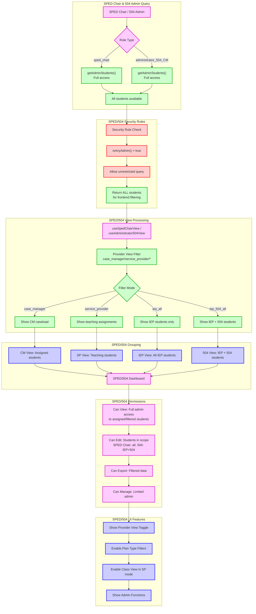

# SPED Chair & 504 Admin View - Specialized Administrative Access

This diagram shows how SPED Chairs and 504 Administrators access students with admin-level permissions but specialized filtering based on their areas of responsibility.

## SPED Chair & 504 Admin Role Characteristics:

### **Database Access**
- **Query Type**: `getAdminStudents()` - unrestricted admin access
- **Security**: Admin-level bypass of database filtering
- **Data Scope**: All students available for frontend filtering
- **Specialization**: Frontend filtering based on role responsibilities

### **Role Differences**

#### **SPED Chair** (`sped_chair`)
- **Scope**: All special education students (IEP focus)
- **Authority**: Full special education program oversight
- **Permissions**: Can edit all IEP students and manage SPED staff
- **Views**: All provider views + IEP-specific filtering

#### **504 Administrator** (`administrator_504_CM`)
- **Scope**: IEP and 504 plan students only
- **Authority**: 504 plan administration and IEP oversight
- **Permissions**: Can edit IEP and 504 students within scope
- **Views**: Case management focus + IEP/504 filtering

### **Provider View System**
Both roles have access to multiple view modes:

#### **Case Manager Mode** (`case_manager`)
- **Shows**: Students where user is assigned as case manager
- **Purpose**: Direct caseload management responsibilities
- **Access**: Full edit permissions for assigned students

#### **Service Provider Mode** (`service_provider`) 
- **Shows**: Students where user teaches or co-teaches
- **Purpose**: Teaching assignment management
- **Access**: Teaching-focused permissions

#### **Specialized Filters**
- **IEP All** (`iep_all`): SPED Chair only - all IEP students
- **IEP + 504 All** (`iep_504_all`): 504 Admin only - IEP and 504 students

### **Permissions by Role**

#### **SPED Chair Permissions**
- ✅ **View**: All student data (admin-level access)
- ✅ **Edit**: All IEP students, limited 504 editing
- ✅ **Export**: All special education data
- ✅ **Manage**: SPED staff, IEP processes, special education settings

#### **504 Administrator Permissions**
- ✅ **View**: IEP and 504 students (filtered admin access)
- ✅ **Edit**: IEP and 504 students within scope
- ✅ **Export**: IEP and 504 plan data
- ✅ **Manage**: 504 processes, limited user management

### **UI Features**
- **Provider View Toggle**: Switch between different role perspectives
- **Plan Type Filters**: Filter by IEP, 504, or combined views
- **Class View**: Available in service provider mode
- **Admin Functions**: Administrative tools appropriate to role scope

### **Security Features**
- **Admin-Level Database**: Unrestricted query with frontend filtering
- **Role-Based Filtering**: Frontend application of role-specific restrictions
- **Scope Validation**: Continuous verification of role authority
- **Audit Logging**: Track administrative actions and view switches

### **Workflow Benefits**
- **Dual Perspective**: Can view as administrator or direct service provider
- **Specialized Focus**: Filtering appropriate to role responsibilities  
- **Administrative Tools**: Access to management functions within scope
- **Flexible Views**: Switch between different professional responsibilities

### **Administrative Scope**
- **SPED Chair**: Broad special education oversight and management
- **504 Admin**: Focused on 504 plan administration with IEP awareness
- **Both**: Can function as case managers or service providers when assigned
- **Limitations**: Scope-appropriate restrictions on student editing and management

This system provides specialized administrative access while maintaining appropriate boundaries based on each role's area of responsibility. 